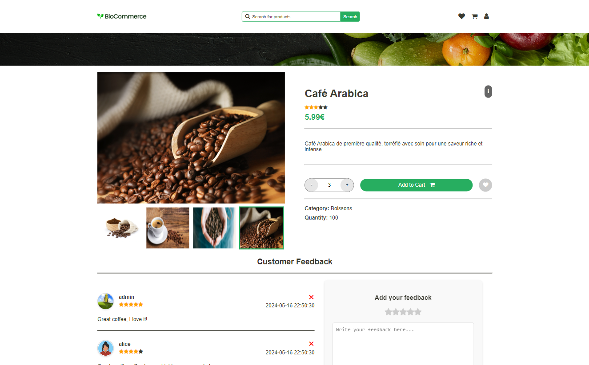

<div align="center">
    
</div>

---

<div align="center">
    
</div>

BioCommerce is a simple e-commerce website for a fictional company. The key features of this website are:

- User authentication
- Product listing
- Product details
- Product filtering
- User feedback (ratings and reviews) for products
- Cart management
- Favorites management
- Transaction history
- User profile management
- Admin panel for managing products and users

## Setup

This project is written in html, css, js, and php. You will need to have php and sqlite3 installed on your machine to run this project.
You can simply run the following command to install the dependencies:

```bash
./install.sh
```

> [!NOTE]
> This script also install browser-sync globally, to enable hot reloading. So you need to have npm installed on your machine.

## Running the project

You can run the project by running the following command:

```bash
php -S localhost:8000
```

Then you can open your browser and navigate to `localhost:8000/pages/index.html` to view the project.

### Hot reloading

For development purposes, you can run the following script to enable hot reloading:

```bash
./hot-reload.sh
```

This will open a port on `localhost:3000` and you can view the project there with hot reloading enabled.
